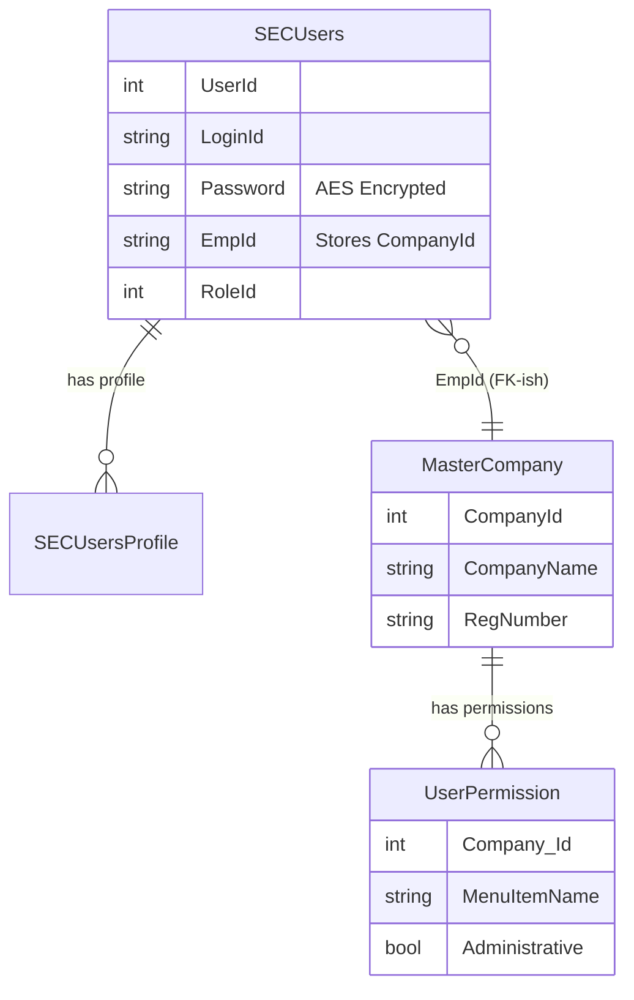

# 🔐 LEGACY SYSTEM AUTHENTICATION & MIGRATION GUIDE

**Date**: February 2, 2026  
**Purpose**: Detailed technical breakdown of the legacy MS SQL authentication flow, specifically for migrating to a modern Identity system (Supabase or .NET Core Identity).  
**Audience**: Developers & AI Assistants (Lovable/Cursor)

---

## 1. 🧠 THE "MENTAL MODEL" OF THE LEGACY SYSTEM

The legacy system (C3WIZARDWebApi) uses a **custom table-based authentication**, NOT standard ASP.NET Identity.

### **Core Entities**:
1.  **`SECUsers`**: The "Gatekeeper" table. Stores credentials and links to companies.
2.  **`MasterCompany`**: Stores business entity data.
3.  **`SECUsersProfile`**: A bridge table explicitly linking Users ↔ Companies.

### **The "Hidden" Link**:
*   **Question**: Where is `CompanyId` stored in the User table?
*   **Answer**: In the **`EmpId`** column.
    *   `SECUsers.EmpId` is a `nvarchar(50)` column.
    *   For Employers, this string contains the integer `CompanyId`.
    *   For Self-Employed, it is usually "0".

---

## 2. 🚦 LEGACY LOGIN FLOW (Step-by-Step)

When a user logs in on the legacy site, this exact sequence happens:

### **Step 1: Validate Credentials**
*   **Input**: `UserName`, `Password`
*   **Logic**:
    *   System encrypts the input password using **AES Symmetric Encryption** (Key: `MAKV2SPBNI99212`).
    *   Query: `SELECT * FROM SECUsers WHERE LoginId = @UserName AND Password = @EncryptedPassword`

### **Step 2: Determine Context (Role & ID)**
*   **If Valid**: System reads `RoleId` and `EmpId`.
*   **Logic**:
    *   **If Role = 3 (Employer)**: 
        *   `CurrentCompanyId` = `int.Parse(SECUsers.EmpId)`
    *   **If Role = 5 (Self-Employed)**: 
        *   `CurrentSelfEmpId` = `int.Parse(SECUsers.SelfEmpID)`

### **Step 3: Load Permissions**
*   **Logic**: System checks the `UserPermission` table using the ID found in Step 2.
    *   Query: `SELECT * FROM UserPermission WHERE Company_Id = @CurrentCompanyId`
*   **Result**: Returns a list of authorized menus (e.g., 'DASHBOARD', 'PAYROLL PROCESS').

---

## 3. 🗺️ MIGRATION MAPPING (Legacy → New System)

This table maps every critical legacy concept to the new Schema.

| Feature | Legacy System (MS SQL) | New System (Supabase / Modern SQL) | Migration Action |
| :--- | :--- | :--- | :--- |
| **Authentication** | Table: `SECUsers` | Table: `auth.users` | **Decrypt** old password -> **Hash** (Bcrypt) -> Insert into `auth.users`. |
| **Username** | Column: `LoginId` | Column: `email` | Copy direct. |
| **User Role** | Column: `RoleId` (Int) | Table: `c3_user_roles` (String) | Map `3` → `'employer'`, `5` → `'self_employed'`. |
| **Company Link** | Column: `EmpId` (String) | Table: `c3_employer_company_links` | Insert row: `user_id` + `company_id`. |
| **Profile Data** | Columns: `FirstName`, `LastName` | Table: `c3_profiles` | Copy direct. |
| **Security Qs** | Table: `SecurityQuestionAnswer` | Table: `c3_profiles` | Columns: `security_question_1`, `security_answer_1`. |
| **Company Data** | Table: `MasterCompany` | Table: `c3_companies` | Copy direct (Keep same `id` to preserve links). |

---

## 4. 🔑 PASSWORD MIGRATION STRATEGY

Since the legacy system uses **Reversible Encryption**, you can migrate users without forcing them to reset passwords.

### **The Algorithm**:
1.  **Read** legacy record from `SECUsers`.
2.  **Decrypt** the password using the legacy AES Key: `"MAKV2SPBNI99212"` (IV: `[0x49, 0x76...0x76]`).
3.  **Hash** the decrypted plain-text password using Supabase/Identity standard (Bcrypt).
4.  **Insert** into new `auth.users` table.

---

## 5. 🏗️ TABLE RELATIONSHIP DIAGRAM

